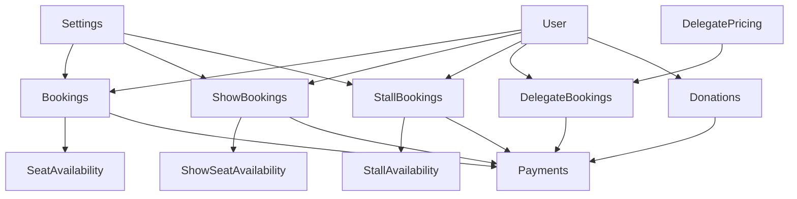

# Booking Flows and Firestore Collections - Complete Documentation

## Overview

This document provides a comprehensive overview of all user-side booking flows and their associated Firestore collections in the Havan Seat Booking system. Each booking type follows a structured multi-step process with specific data storage patterns and payment integration.

---

## 1. Havan Booking Flow (Main Booking)

### **Flow Steps:**
1. **Select Date** - Choose event date from available options
2. **Select Shift** - Choose timing (Morning: 9 AM - 12 PM, Afternoon: 2 PM - 5 PM)
3. **Choose Your Spots** - Interactive seat map with real-time availability
4. **Your Details** - Customer information form
5. **Payment** - CCAvenue payment processing

### **Firestore Collections:**

#### Primary Collection: `bookings`
```javascript
// Document Structure
{
  id: "BK1699123456", // Auto-generated or custom ID
  bookingId: "BK1699123456",
  userId: "user_uid", // Firebase Auth UID
  eventDate: Timestamp,
  shift: "morning" | "afternoon",
  seats: ["A1", "A2", "B5"], // Array of selected seat IDs
  customerDetails: {
    name: "John Doe",
    email: "john@example.com",
    phone: "+919876543210",
    address: "Complete address",
    aadhar: "Masked aadhar number"
  },
  totalAmount: 1500,
  baseAmount: 1500,
  discountAmount: 0,
  status: "pending_payment" | "confirmed" | "cancelled",
  payment: {
    gateway: "ccavenue",
    status: "Success" | "Failed",
    transactionId: "tracking_id",
    bankRefNo: "bank_ref_number",
    paymentMode: "Net Banking",
    amount: 1500,
    currency: "INR",
    processedAt: Timestamp
  },
  createdAt: Timestamp,
  updatedAt: Timestamp,
  confirmedAt: Timestamp, // Only when payment successful
  expiryTime: Timestamp // 15 minutes from creation
}
```

#### Availability Collection: `seatAvailability`
```javascript
// Document ID: "${dateKey}_${shift}" (e.g., "2024-01-15_morning")
{
  date: "2024-01-15",
  shift: "morning",
  seats: {
    "A1": {
      booked: true,
      blocked: false,
      userId: "user_uid",
      customerName: "John Doe",
      bookingId: "BK1699123456",
      bookedAt: Timestamp,
      confirmedAt: Timestamp
    },
    "A2": {
      booked: false,
      blocked: true, // Temporarily blocked during booking process
      userId: "user_uid",
      bookingId: "BK1699123456",
      blockedAt: Timestamp
    }
    // ... other seats
  },
  updatedAt: Timestamp
}
```

#### Settings Collection: `settings`
```javascript
// Document ID: "pricing"
{
  havanPricing: {
    defaultSeatPrice: 500,
    earlyBirdDiscount: {
      percentage: 15,
      daysBeforeEvent: 30
    },
    bulkBookingDiscount: {
      percentage: 10,
      minimumSeats: 5
    }
  }
}
```

---

## 2. Show Seat Booking Flow

### **Flow Steps:**
1. **Select Date** - Choose show date
2. **Choose Places** - Interactive seat selection
3. **Your Details** - User information
4. **Payment** - Payment processing

### **Firestore Collections:**

#### Primary Collection: `showBookings`
```javascript
// Document Structure
{
  id: "auto-generated-firebase-id", // Firebase auto-generated
  userId: "user_uid",
  showDetails: {
    date: Timestamp,
    selectedSeats: ["S1", "S2", "S3"],
    totalPrice: 2000,
    seatingPreference: "premium"
  },
  userDetails: {
    name: "Jane Smith",
    email: "jane@example.com",
    phone: "+919876543210",
    address: "User address"
  },
  totalAmount: 2000,
  status: "pending_payment" | "confirmed" | "cancelled",
  payment: {
    gateway: "ccavenue",
    status: "Success" | "Failed",
    transactionId: "tracking_id",
    amount: 2000,
    currency: "INR",
    processedAt: Timestamp
  },
  createdAt: Timestamp,
  updatedAt: Timestamp
}
```

#### Availability Collection: `showSeatAvailability`
```javascript
// Document ID: dateKey (e.g., "2024-01-15")
{
  date: "2024-01-15",
  seats: {
    "S1": {
      booked: true,
      blocked: false,
      userId: "user_uid",
      customerName: "Jane Smith",
      bookingId: "firebase-id",
      bookedAt: Timestamp,
      confirmedAt: Timestamp
    }
    // ... other seats
  },
  updatedAt: Timestamp
}
```

---

## 3. Stall Booking Flow

### **Flow Steps:**
1. **Choose Stalls** - Interactive stall map selection
2. **Vendor Details** - Business information form
3. **Payment** - Complete booking with payment

### **Firestore Collections:**

#### Primary Collection: `stallBookings`
```javascript
// Document Structure
{
  id: "STALL-" + timestamp, // Custom ID format
  bookingId: "STALL-1699123456",
  userId: "user_uid",
  stallIds: ["ST01", "ST05", "ST12"], // Array of selected stall IDs
  vendorDetails: {
    businessType: "Food & Beverages",
    ownerName: "Business Owner",
    email: "business@example.com",
    phone: "+919876543210",
    address: "Business address",
    aadhar: "Aadhar details"
  },
  totalAmount: 15000,
  eventDuration: 5, // 5-day event
  status: "pending_payment" | "confirmed" | "cancelled",
  payment: {
    gateway: "ccavenue",
    status: "Success" | "Failed",
    transactionId: "tracking_id",
    amount: 15000,
    currency: "INR",
    processedAt: Timestamp
  },
  createdAt: Timestamp,
  updatedAt: Timestamp
}
```

#### Availability Collection: `stallAvailability`
```javascript
// Document ID: "current"
{
  stalls: {
    "ST01": {
      booked: true,
      blocked: false,
      vendorName: "Business Owner",
      businessType: "Food & Beverages",
      bookingId: "STALL-1699123456",
      bookedAt: Timestamp,
      confirmedAt: Timestamp
    },
    "ST05": {
      booked: false,
      blocked: true, // Temporarily blocked
      bookingId: "STALL-1699123456",
      blockedAt: Timestamp
    }
    // ... other stalls
  },
  updatedAt: Timestamp
}
```

---

## 4. Delegate Registration Flow

### **Flow Steps:**
This is a single-page form (not multi-step) with comprehensive information collection and file upload.

### **Firestore Collections:**

#### Primary Collection: `delegateBookings`
```javascript
// Document Structure
{
  id: "DELEGATE-" + timestamp, // Custom ID format
  bookingId: "DELEGATE-1699123456",
  userId: "user_uid",
  delegateDetails: {
    name: "Dr. John Smith",
    email: "dr.john@example.com",
    mobile: "+919876543210",
    designation: "Director",
    address: "Complete address",
    city: "New Delhi",
    state: "Delhi",
    country: "India",
    pincode: "110001",
    aadharno: "123456789012",
    pan: "ABCDE1234F",
    passportno: "A1234567", // Optional for international delegates
    fileInfo: {
      fileUploaded: true,
      imageUrl: "gs://bucket/path/to/image.jpg",
      uploadedAt: Timestamp
    }
  },
  eventDetails: {
    registrationType: "Individual" | "Company" | "Temple",
    companyName: "Company Name", // If Company registration
    templeName: "Temple Name", // If Temple registration
    delegateType: "withoutAssistance" | "withAssistance",
    numberOfPersons: 2,
    duration: "3 days",
    briefProfile: "Brief description for temple registration"
  },
  totalAmount: 5000,
  status: "pending" | "confirmed" | "cancelled" | "cancellation-requested",
  participated: false, // Track actual participation
  participatedAt: Timestamp, // When marked as participated
  payment: {
    gateway: "ccavenue",
    status: "Success" | "Failed",
    transactionId: "tracking_id",
    amount: 5000,
    paymentId: "payment_id",
    method: "Net Banking"
  },
  createdAt: Timestamp,
  updatedAt: Timestamp
}
```

#### Pricing Collection: `delegatePricing`
```javascript
// Document ID: "current"
{
  packages: {
    withoutAssistance: {
      individual: 3000,
      company: 5000,
      temple: 4000
    },
    withAssistance: {
      individual: 5000,
      company: 8000,
      temple: 6000
    }
  },
  additionalPersonCharge: 1000,
  updatedAt: Timestamp
}
```

---

## 5. Donation Flow

### **Flow Steps:**
This is a single-page form with donor details and payment integration.

### **Firestore Collections:**

#### Primary Collection: `donations`
```javascript
// Document Structure
{
  id: "DN" + timestamp, // Custom ID format
  donationId: "DN1699123456",
  userId: "user_uid", // Optional - can be null for anonymous donations
  donorDetails: {
    name: "Generous Donor",
    email: "donor@example.com",
    mobile: "+919876543210",
    address: "Donor address",
    city: "Mumbai",
    state: "Maharashtra",
    country: "India",
    pincode: "400001",
    donorType: "indian" | "foreign"
  },
  amount: 10000,
  currency: "INR",
  purpose: "donation",
  donorType: "indian" | "foreign",
  status: "pending_payment" | "confirmed" | "cancelled",
  paymentGateway: "ccavenue",
  taxExemption: {
    eligible: true,
    section: "80G",
    certificateRequired: true
  },
  payment: {
    gateway: "ccavenue",
    status: "Success" | "Failed",
    transactionId: "tracking_id",
    amount: 10000,
    currency: "INR",
    processedAt: Timestamp
  },
  createdAt: Timestamp,
  updatedAt: Timestamp,
  expiryTime: Timestamp // 15 minutes from creation
}
```

---

## Common Collections Used Across All Flows

### **User Collection: `users`**
```javascript
// Document ID: user.uid (Firebase Auth UID)
{
  uid: "firebase_auth_uid",
  email: "user@example.com",
  name: "User Name",
  phone: "+919876543210",
  createdAt: Timestamp,
  lastLoginAt: Timestamp,
  bookingHistory: {
    havan: ["BK1699123456"],
    show: ["show-booking-id"],
    stall: ["STALL-1699123456"],
    delegate: ["DELEGATE-1699123456"],
    donation: ["DN1699123456"]
  }
}
```

### **Payment Processing Collection: `payments`**
```javascript
// Document ID: transaction_id or booking_id
{
  orderId: "BK1699123456",
  bookingType: "havan" | "show" | "stall" | "delegate" | "donation",
  amount: 1500,
  currency: "INR",
  gateway: "ccavenue",
  status: "pending" | "success" | "failed",
  ccavenueData: {
    trackingId: "tracking_id",
    bankRefNo: "bank_ref_no",
    orderStatus: "Success",
    paymentMode: "Net Banking",
    responseCode: "0",
    statusCode: "200"
  },
  createdAt: Timestamp,
  processedAt: Timestamp
}
```

### **Activity Logs Collection: `activityLogs`**
```javascript
// Document ID: auto-generated
{
  userId: "user_uid",
  bookingId: "BK1699123456",
  bookingType: "havan",
  action: "booking_created" | "payment_completed" | "booking_cancelled",
  details: "Booking created for 3 seats",
  timestamp: Timestamp,
  userAgent: "browser_info",
  ipAddress: "user_ip"
}
```

---

## Real-Time Data Flow and State Management

### **Seat/Stall Blocking Mechanism:**
1. **Temporary Block**: When user selects seats/stalls, they're marked as `blocked: true` for 15 minutes
2. **Automatic Release**: Firestore cleanup functions release expired blocks
3. **Real-time Updates**: All users see live availability through Firestore listeners

### **Payment Flow Integration:**
1. **Booking Creation**: Record created with `pending_payment` status
2. **Payment Gateway**: CCAvenue integration with encrypted request/response
3. **Webhook Processing**: Payment confirmation updates booking status
4. **Cleanup**: Failed payments trigger automatic seat/stall release

### **Data Consistency:**
- **Transactions**: Critical operations use Firestore transactions
- **Cleanup Functions**: Scheduled functions handle expired bookings
- **Validation**: Client and server-side validation for data integrity

---

## Key Features and Patterns

### **Common Patterns Across All Flows:**
1. **Progressive Form Validation**: Real-time validation as user progresses
2. **State Persistence**: Form data persisted across page refreshes
3. **Real-time Updates**: Live availability updates using Firestore listeners
4. **Payment Integration**: Consistent CCAvenue integration across all booking types
5. **Email Confirmations**: Automated confirmation emails post-payment
6. **Admin Management**: Comprehensive admin interface for all booking types

### **Unique Features:**
- **Havan**: Time-based shifts and complex pricing with discounts
- **Show**: Simple date-based booking with premium seating options
- **Stall**: Business-focused with vendor details and multi-day events
- **Delegate**: Document upload and verification with participation tracking
- **Donation**: Tax exemption certificates and international donor support

---

## Database Relationships



This comprehensive documentation covers all booking flows and their associated Firestore collections, providing a complete reference for understanding the system architecture and data flow patterns.
